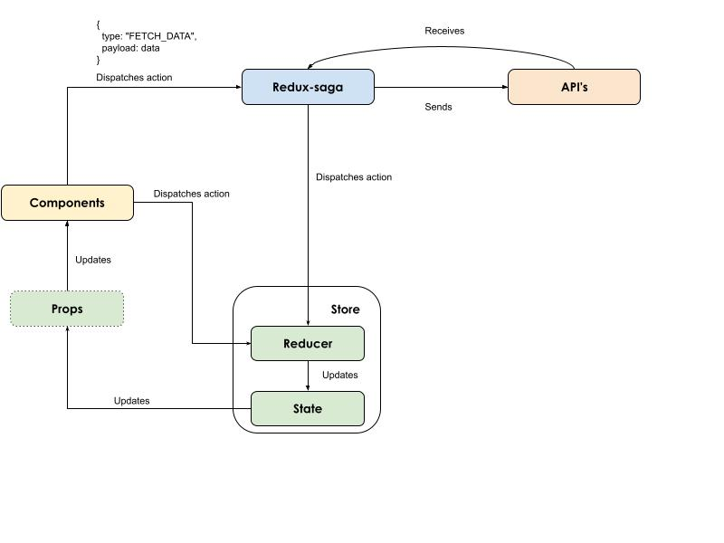
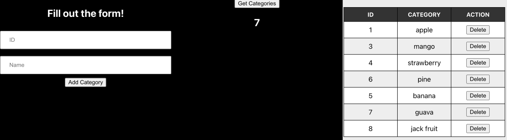

# Redux Saga



* Reference: <a href="https://oclipa.github.io/reactjs-cheat-sheet/">Cheatsheet</a>

<p>A “saga” is essentially a function that runs in response to actions and handles all of the side-effects (e.g. accessing local storage, or querying a server) associated with the action.</p>

<p>A side-effect is any behaviour that does not directly affect the Redux store (it might change the state, but is not directly consumed by the reducer).</p>
<p>More specifically, a saga is an example of a Generator, which is a special form of function that allows code to be paused and resumed.</p>

<p>The basic pattern for the Redux Saga approach is:</p>

* A **central saga** file is created that exposes all other sagas:

```
export function rootSaga() { 
    yield takeEvery(actionTypes.INITIATE_SOMETHING, doSideEffectsSaga); 
    ...etc... 
}
```
* The sagas are registered with the middleware:
```
sagaMiddleware.run(rootSaga);
```
* An **action** is requested somewhere in the app:
```
doSomething = () => { dispatch(actions.initiateSomething()); }
```
* An **action trigger id** is returned by an **action creator**:
```
initiateSomething = () => { return { type: actionTypes.INITIATE_SOMETHING, }; }
```
* The **watcher** intercepts the action trigger id and triggers the related saga, which performs side-effects and then returns a reducer trigger id:
```
function* doSideEffectsSaga() { yield sideEffect(); yield put({ type: actionTypes.COMPLETE_SOMETHING, }); }
```
* The **reducer** intercepts the trigger id and triggers a related action:
```
switch (action.type) { case actionTypes.COMPLETE_SOMETHING: { return updateStateOfSomethingInStore(state, action); } }
```
* The **action** updates the Redux store:
```
updateStateOfSomethingInStore = (state, action) => { return updateStore(state, updatedState); };
```

## Project Folder Structure
```
src/
├── actions/
├── reducers/
├── sagas/
├── components/
├── store.js
└── App.js
```

## Project Setup
* Make sure NodeJS is installed 
* * $ node -v
* Create a react project
* * $ npx create-react-app stock-project
* * $ cd stock-project
* * $ npm install react-redux redux redux-saga

## Test run the application
* * $ npm run start

## Replace createStore with configureStore
* * $ npm i @reduxjs/toolkit

## Setup a JSON DB server
* * $ npm install -g json-server
* * $ json-server ~/json/db.json
* * $ npx json-server --watch db.json --port 3001

## Project Output

